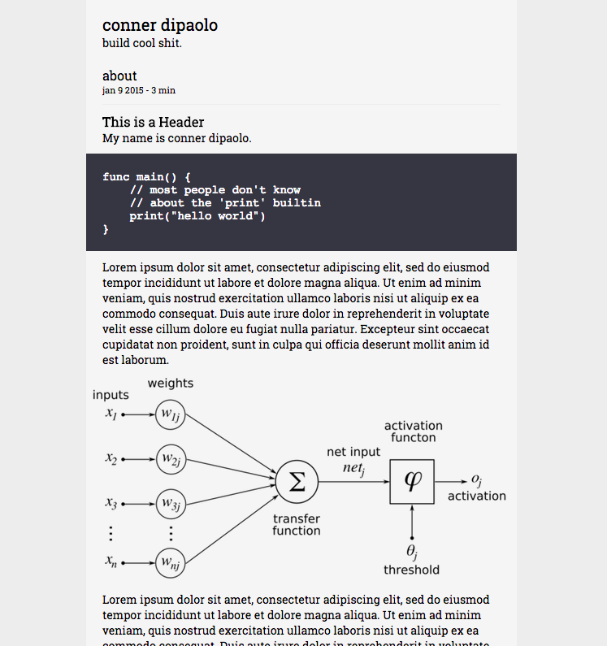

#### gindoro
##### a minimalistic Hugo blogging theme in < 6K

[example site](http://dipaolo.conner.sh)

only two pages – index and post

no syntax highlighting (but code blocks do look nice regardless!)

LaTeX support built in (using KaTeX via CDN for fast rendering)




### installation

**configuration**

config.toml can include the following parameters (below is a complete example that will function as-is.) The example results in the above site with footer links to github and contact:

```toml
baseurl = "http://dipaolo.conner.sh"
languageCode = "en-us"
title = "conner dipaolo"

[params]
  Description = "build cool shit."
  Author = "conner dipaolo"
  GithubUser = "cdipaolo"
  Email = "cdipaolo96@gmail.com"
```

**starting a new blog**

these instructions are strikingly similar to [the Hugo quickstart guide](http://gohugo.io/overview/quickstart/)!

```bash
$ hugo new site path/to/site
$ cd path/to/site

# make a post (can edit later!)
$ hugo new hello-world.md

# install theme
$ git clone https://github.com/cdipaolo/gindoro themes

# run site!
$ hugo server -t gindoro --buildDrafts
2 pages created
0 tags created
0 categories created
in 5 ms
Serving pages from exampleHugoSite/public
Web Server is available at http://localhost:1313
Press Ctrl+C to stop
```
